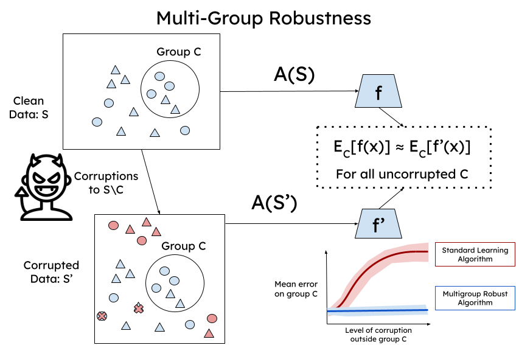

# Multigroup Robustness

This repo contains code for experiments in the paper [Multigroup Robustness](https://arxiv.org/abs/2405.00614) by Lunjia 
Hu, Charlotte Peale, and Judy Hanwen Shen. This paper will appear at FORC 2024 and ICML 2024. 



## Algorithms
We include a new implementation of empirical multiaccuracy boosting algorithm that works with any sklearn base classifier.
The algorithm is implement in [models.py](models.py) and [subgroup_noise.ipynb](subgroup_noise.ipynb) gives examples 
how to use the algorithm. 

### Attacks 
We consider two different attacks that reflect the two types of adversaries we consider: 
- Random Label Flipping: This attack is based on label flipping attacks that appear in prior work
[Xiao et. al. 2012](https://dl.acm.org/doi/10.5555/3007337.3007488). In our implementation of the attack, labels of a 
class are randomly flipped. This corresponds to the weak adversary in our work where the adversary only has access to the
distribution but not the empirical dataset. 
- Data Addition: We also use a more targeted attack that corresponds to the strong adversary in our work that can modify
the training data set. We follow the approach of [Jagielski et. al.](https://arxiv.org/abs/2006.14026) in identifying which
data points in the group we are able to modifiy to add in order to affect the target group. 

### Baselines
We consider the following models: 
- Logistic Regression
- K-Nearest Neighbors
- XGBoost
- MLP 
- Decision Trees
- Robust Linear Regression [Feng et. al.](https://proceedings.neurips.cc/paper_files/paper/2014/file/6cdd60ea0045eb7a6ec44c54d29ed402-Paper.pdf)
In addition, we implement data sanitization as an option before training each of the models [Paudice et. al.](https://arxiv.org/abs/1803.00992)
as well as an empirical multi accuracy boosting algorithm from uniform labels. 

### Datasets
We evaluate our algorithms on the following standard datasets: 
- [ACS Income, Employment, and Coverage](https://github.com/socialfoundations/folktables) 
- [Law School](https://search.r-project.org/CRAN/refmans/bootstrap/html/law.html)
- [Bank](https://archive.ics.uci.edu/dataset/222/bank+marketing)

### Quick Start
To run the baselines and boosting algorithm on the income dataset with the label flipping on the white male group: 
```
python run_group_robust --dataset=income --shift --modify='white-male' --num_runs=5
```

To run the baselines and boosting algorithm on the income dataset with label sanitization under the addition attack by modifying the white male group and targeting the white female group: 

```
python run_group_robust --dataset=income --addition --target='white-female' --modify="white-male" --num_runs=5 --target="white-female" --sanitize
```
